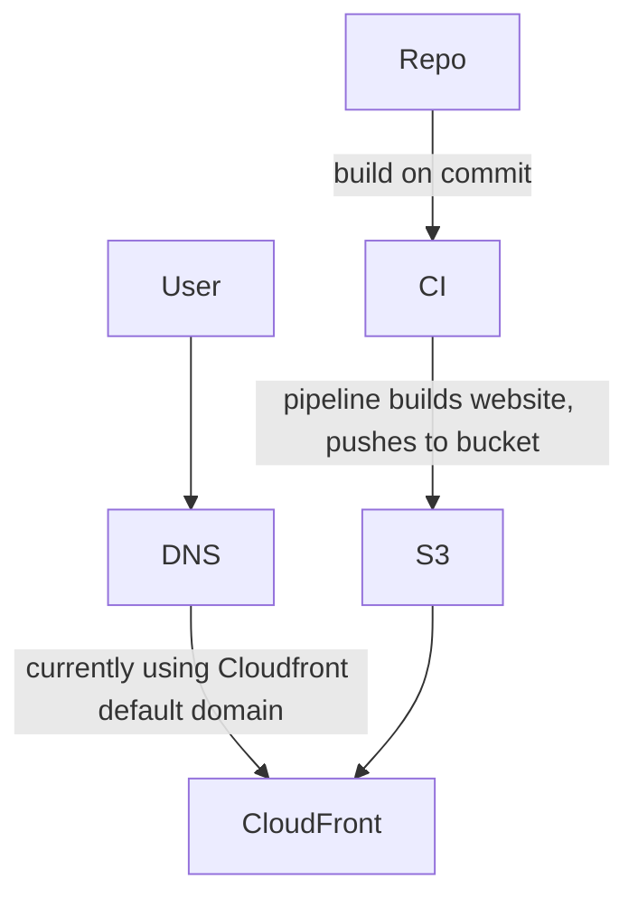

## Introduction
This purpose of this project is to update the continuous integration pipeline for an open source project located at (https://github.com/facebookresearch/ParlAI).
The CI pipeline is updated by integrating Terraform configuration files within CircleCI workflow to build and deploy a static website for hosting in an Amazon S3 bucket. CloudFront was 
configured for routing and CDN capabilities, All terraform files are found in the terraform folder including addtional configurations for DNS vis AWS route53 and for Certificate Manager.  
The build was tested and ran successfully. Please see the additional configurations within update-pipeline branch.

## Architecture
As the site, once built, it's static content being successfully hosted on S3, I decided to build upon this by adding routing and CDN capabilities via CloudFront.

Architecture:
 User -> route53 -> cloudfront -> S3 (www redirect) -> (S3 with content)

### Other Components
Terraform is one of the Infrastructure as Code (IaC) tools developed by HashiCorp that is used in this project to build and manage the AWS infrastructure.
CircleCI is a continuous integration and continuous delivery (CI/CD) platform that integrates with GitHub automates the build, test, and deployment of the static Website
GitHub stores the code and manages versioning

## Initial exploration:
I first attempted a workflow that used the Dockerfile to build a docker image and push the image to Amazon ECR, the goal was to containerize using ECS. The main issue faced was disk size, I used GitHub Actions for the workflow and the runners given consistently ran out of disk space due to the large size (over 42 megabyte) of the image. I therefore changed plans and used CircleCI and a S3 bucket for hosting. 
First, attempts to build website on local machine. Had issues with dependencies, primarily PyTorch during the building of /docs.
Tested build within Circle CI pipeline, built successfully. Noted addiitional torch dependency steps.

Configured terraform to create an S3 bucket, enable hosting, add built files, also  CloudFront.
(Also created code for route53 and certificates, but went with cloudfront defaults for this demo rather than an at-cost domain)

Tested terraform in its own pipeline. Successfully accessed website through Cloudfront

Attempted to integrate into the existing ParlAI pipeline using dynamic config. Was unsuccessful in linking a secondary .yml file into .circleci/config.yml

## Thoughts, dilemmas, challenges
- Too many heavy dependencies just for building static website content. Look at ways to separate unnecessary dependenies from buld step
- Unit or other tests failing outside of website build
- Long build time overall
- * Due to initial inability to build via make, I looked at non-static solutions in case there were not html files available
Built files for initial tests by running generate.py directly, excluding the /docs build
- Had permission issues adding ACLs and policies to my S3 bucket when using my own module, so switched to hashicorp's S3 module
- I first applied Terraform to build an S3 bucket to use as the backend, then set another S3 bucket as the resource to be created in the pipeline
